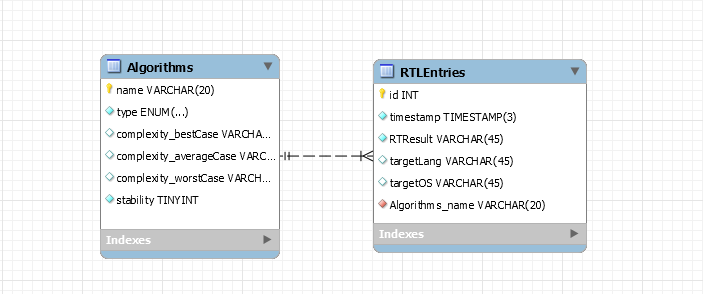

# Sorting Algorithm Performance Evaluator <!-- omit in toc -->
>Sorting algorithm perfomance assessment developer tool

- [Introduction](#introduction)
- [Aim and purpose](#aim-and-purpose)
  - [Research questions](#research-questions)
- [Database](#database)
- [Tasks](#tasks)

## Introduction

Sorting, as intended as the operation of alphabetizing, categorizing, arranging or putting items in a pre-defined ordered sequence, is a “key fundamental operation in the field of computer science” (Idrees, 2016) as it adds “usefulness”(Idrees, 2016) to the data. A sorting algorithm takes a number of items, typically an array or a list, and outputs a permutation of that input that is sorted. All sorting algorithms, by intrinsic nature, are problem specific and its choice highly depends on the properties of the manipulated data, the system requirements and against any possible operations that might be performed upon it. Having a clear understanding of the problem’s specifics and details is a fundamental requirement in the decision of the sorting algorithm; however, in some scenarios where the problem’s complexity is high or inherently difficult, the choice of a sorting algorithm, in terms of performance and systems’ required deliverables, might take a nontrivial role. For this reason, in such scenarios, a direct simulation and evaluation of different sorting algorithms, in a testing environment, with the aim of comparing the performance in a simulated scenario, characterized by real world problems’ specifics, might represent the breakthrough towards the resolution of the problem.
Currently available algorithms evaluators lack the most important features that are required by current industry standard and state of the art workflows. The current paper outlines the design and implementation of a sorting algorithm evaluator that provides a user-settable testing environment that allows real-time cloud simulations of the provided data over custom system requirements. Every evaluator is carried out in a node cluster, allowing end system requirements hardware simulation, language specific performance testing and easy horizontal and vertical cluster scaling.

## Aim and purpose

### Research questions

1. What commonly used sorting algorithm performs the best at sorting primitive datatypes?
2. What commonly used sorting algorithm performs the best at sorting non-primitive datatypes?
3. Serial Sort versus Parallel Sort – Which one is better and when?

## Database

For the following project a relational database MySQL v5.7 and the following ER and EER have been designed to fullfil the system requirements

## Tasks

First draft - _Total 104hrs_.
- [x]  Create project's structure and working tools (Setup working environment) **{8 HRS}** `#PRM#1 04/30/2020` :bookmark:
  - [x]  ~~Github Repo Setup~~
  - [x]  ~~Github Readme~~
  - [x]  ~~Github License~~
  - [x]  ~~Github KIB~~
  - [x]  ~~GitkrakenGlo Github KIB Sync~~
  - [x]  ~~GitGlow TaskLink & Sync~~
  - [x]  ~~KIB Tasks & Labels~~
  - [x]  ~~KIB M#1 Milestone setup~~
  - [x]  ~~Timeline Setup w/ milestones~~
  - [x]  ~~Team members invitation to KIB & Working setup~~ 
- [ ]  Create testing units **{8 HRS}**
- [ ]  Create mock database's classes **{8 HRS}**
- [ ]  Sorting algorithm research and implementation in Java **{40 HRS}**
  - [ ]  RESEARCH (Introduction and RQ definition) 
  - [ ]  IMPLEMENTATION (Heap, merge, shell, quick)
- [ ] Meeting planning & TO DO definition **{16 HRS}**
- [ ] Preparation for (each) release **{16 HRS}**
- [ ] Run testing and assure working deployable version **{8 HRS}**