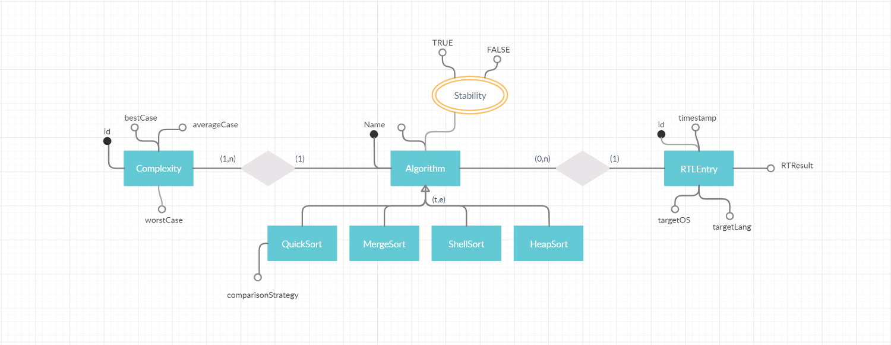
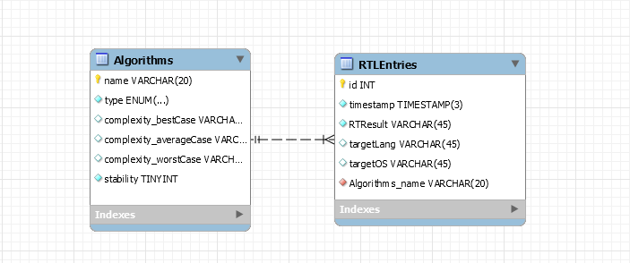

# Sorting Algorithm Performance Evaluator <!-- omit in toc -->
>Sorting algorithm perfomance assessment developer tool

- [Introduction](#introduction)
- [Aim and purpose](#aim-and-purpose)
  - [Research questions](#research-questions)
- [Database](#database)
- [Tasks](#tasks)
- [Test Driven Development](#test-driven-development)
- [Method](#method)
  - [Create the development environment](#create-the-development-environment)
  - [Diagrams](#diagrams)
  - [IntelliJ project](#intellij-project)
  - [Github repository](#github-repository)
  - [GitKraken management](#gitkraken-management)
  - [Peer-Programming](#peer-programming)
  - [Research on the selected algorithms](#research-on-the-selected-algorithms)
  - [Algorithms implementation](#algorithms-implementation)
  - [Database implementation](#database-implementation)
  - [Experiment. Data collection. Analyze](#experiment-data-collection-analyze)
  - [Results](#results)
- [Velocity](#velocity)
  - [First iteration](#first-iteration)
  - [Second iteration](#second-iteration)
  - [Third iteration](#third-iteration)

## Introduction

Sorting, as intended as the operation of alphabetizing, categorizing, arranging or putting items in a pre-defined ordered sequence, is a “key fundamental operation in the field of computer science” (Idrees, 2016) as it adds “usefulness”(Idrees, 2016) to the data. A sorting algorithm takes a number of items, typically an array or a list, and outputs a permutation of that input that is sorted. All sorting algorithms, by intrinsic nature, are problem specific and its choice highly depends on the properties of the manipulated data, the system requirements and against any possible operations that might be performed upon it. Having a clear understanding of the problem’s specifics and details is a fundamental requirement in the decision of the sorting algorithm; however, in some scenarios where the problem’s complexity is high or inherently difficult, the choice of a sorting algorithm, in terms of performance and systems’ required deliverables, might take a nontrivial role. For this reason, in such scenarios, a direct simulation and evaluation of different sorting algorithms, in a testing environment, with the aim of comparing the performance in a simulated scenario, characterized by real world problems’ specifics, might represent the breakthrough towards the resolution of the problem.
Currently available algorithms evaluators lack the most important features that are required by current industry standard and state of the art workflows. The current paper outlines the design and implementation of a sorting algorithm evaluator that provides a user-settable testing environment that allows real-time cloud simulations of the provided data over custom system requirements. Every evaluator is carried out in a node cluster, allowing end system requirements hardware simulation, language specific performance testing and easy horizontal and vertical cluster scaling.

## Aim and purpose

### Research questions

1. What commonly used sorting algorithm performs faster at sorting primitive datatypes?
2. ~~How 'In-place' strategy can influence the performance of the sorting algorithms?~~
3. What methodology is the most effective for sorting positive small integers?

## Database

For the following project a relational database MySQL v5.7 and the following ER and EER have been designed to fullfil the system requirements

 

## Tasks

First draft - _Total 104hrs_.
- [x]  **`104 HRS`**:bookmark:
  - [x]  Create project's structure and working tools (Setup working environment)
    - [x]  ~~Github Repo Setup~~
    - [x]  ~~Github Readme~~
    - [x]  ~~Github License~~
    - [x]  ~~Github KIB~~
    - [x]  ~~GitkrakenGlo Github KIB Sync~~
    - [x]  ~~GitGlow TaskLink & Sync~~
    - [x]  ~~KIB Tasks & Labels~~
    - [x]  ~~KIB M#1 Milestone setup~~
    - [x]  ~~Timeline Setup w/ milestones~~
    - [x]  ~~Team members invitation to KIB & Working setup~~ 
  
- [x]  **`104 HRS`**:bookmark:
  - [x] Project setup **`7 HRS`**
    - [x] ~~Project boilerplate~~
    - [x] ~~Dependency management~~
    - [x] ~~JUnit integration~~
    - [x] ~~Maven integration~~
  - [x] Algorithm implementation (Min.1) **`13 HRS`**
    - [x] ~~Quick Sort~~
    - [x] ~~Merge Sort~~
    - [x] ~~Shell Sort~~
    - [x] ~~Heap Sort~~
  - [x] ~~Unit testing~~ **`23 HRS`**
  - [x] ~~Database Mocks~~ **`15 HRS`**
  - [x] ~~Meeting planning & TO DO definition~~ **`16 HRS`**
  - [x] ~~Preparation for (each) release~~ **`16 HRS`**
  - [x] ~~Run testing and assure working deployable version~~ **`3 HRS`**
  - [x] ~~Code refactoring, Git revisioning, readme and miscs chores~~ **`11 HRS`**

- [x]  **`104 HRS`**:bookmark:
  - [x] ~~Database~~
    - [x] ~~DB Design and ER, EER~~
    - [x] ~~Translation of EER into logical model~~
    - [x] ~~Database creation (hosting::gearhost)~~
    - [x] ~~Java DB Entity Classes - 1:1 table mapping~~
    - [x] ~~Database adapter | Hibernate or MySQL Connector~~
  - [x] ~~Algorithm implementation~~
    - [x] ~~Quick Sort Median-of-three __comparator__~~
    - [x] ~~Shell Sort~~
    - [x] ~~Heap Sort~~
  - [x] ~~Velocity~~
  - [x] ~~Meeting planning & TO DO definition **`16 HRS`**~~
  - [x] ~~Preparation for (each) release **`16 HRS`**~~
  - [x] ~~Run testing and assure working deployable version **`3 HRS`**~~
  - [x] ~~Code refactoring, readme and miscs chores **`11 HRS`**~~
  
 - [ ]  **`104 HRS`**:bookmark:
  - [ ] Experiment **`16 HRS`**. 
    - [ ] Data collection **`8 HRS`**. 
    - [ ] Analyze **`8 HRS`**.
    - [ ] Result **`8 HRS`**.
  - [ ] Conclusions **`8 HRS`**.
  - [ ] Velocity **`16 HRS`**.
  - [ ] Meeting planning & TO DO definition **`16 HRS`**
  - [ ] Preparation for presentation **`6 HRS`**
  - [ ] Power point presentation **`16 HRS`**.
  - [ ] Submit project documentation **`2 HRS`**.
  
  

## Test Driven Development

At the beginning of the project the requirements and objectives of the first sprint were analyzed. Entities were built and the relationships between them was established. Based on these data the unit tests were built. Methods were developed and automatic testing was used.

## Method

### Create the development environment 
/** Vincenzo*/
### Diagrams
/** Vincenzo*/
### IntelliJ project
/** Chris*/
### Github repository
/** Chris*/
### GitKraken management
/** Chris*/
### Peer-Programming
/** Alex&Nemanja*/
### Research on the selected algorithms
#### Sorting Algorithms
**Table 1. Sorting algorithms time complexities' [1]** 
|    **Algorithm        |   Best   |  Average  |  Worst  |  Space Complexity**|
| ----------------------| --------:|----------:|--------:|-------------------:|
| Quicksort             |Ω(nlog(n))|Θ(nlog(n)) |O(n^2)   |    O(log(n))       |
| Mergesort             |Ω(nlog(n))|Θ(nlog(n)) |O(nlogn) |    O(n)            |
| Timsort               |Ω(n)      |Θ(nlog(n)) |O(nlogn) |    O(n)            |
| Heapsort              |Ω(nlog(n))|Θ(nlog(n)) |O(nlogn) |    O(1)            |
| Bubble Sort           |Ω(n)      |Θ(n^2)     |O(n^2)   |    O(1)            |
| Insertion Sort        |Ω(n)      |Θ(n^2)     |O(n^2)   |    O(1)            |
| Selection Sort        |Ω(n^2)    |Θ(n^2)     |O(n^2)   |    O(1)            |
| Tree Sort             |Ω(nlog(n))|Θ(nlog(n)) |O(n^2)   |    O(n)            |
| Shell Sort            |Ω(nlog(n))|Θ(nlog(n)) |O(nlogn) |    O(1)            |
| Bucket Sort           |Ω(n + k)  |Θ(n + k )  |O(n^2)   |    O(n)            |
| Radix Sort            |Ω(nk)     |Θ(nk)      |O(nk)    |    O(n + k)        |
| Counting Sort         |Ω(n + k)  |Θ(n + k )  |O(n + k) |    O(k)            |
| Cubesort              |Ω(n)      |Θ(nlog(n)) |O(nlogn) |    O(n)            |

Sorting is a process of ordering a list of elements. There are two types of sorting in total: internal sorting and external sorting. The internal sorting is the sort in which the number of elements is small enough to fit into the main memory, and the opposite - the external sorting sorts the elements that are too many so that some of them occupy external storage during the sort. The sorting algorithms that are tested for this report all belong to the internal sorting group and are: Quick Sort, Merge Sort, Heap Sort and Shell sort.

#### Algorithms Time Complexity 
##### Mathematical background
The running time of an algorithm is one of the most important resources that should be analyzed. When considering the time complexity, the size of the input to be sorted is the main consideration. [2] Tavg(N) and Tworst(N) are the two functions: the average and worst-case running time considering N as the input size. Mathematical Background definitions of the algorithm analysis[2]

  - Definition 2.1.
  T(N) = O(f (N)) if there are positive constants c and n0 such that T(N) ≤ cf (N) when
  N ≥ n0.

  - Definition 2.2.
  T(N) = Ω(g(N)) if there are positive constants c and n0 such that T(N) ≥ cg(N) when
  N ≥ n0.

  - Definition 2.3.
  T(N) = Θ(h(N)) if and only if T(N) = O(h(N)) and T(N) = Ω(h(N)).
  
Definitions provide us with a few useful notations: O - the Big-Oh notation, Ω - the Omega notation and the Theta notation. 
O(f(N)) - the upper bound for T(N)
Ω(f(N)) - the lower bound for T(N)
Θ(f(N)) - the exact bound for T(N)
The Big-Oh represents the worst-case behavior so it is of a big importance for the time complexity.
There are also other variants of notations but due to their irrelevance for this research purpose, they will not be discussed.

#### Selected Algorithms Complexity
For this project, four sorting algorithms were chosen, which in part use separate methodologies. The goal was to analyze and understand the main differences between them, and how they influence efficiency. Table 1 shows the chosen algorithms and the methodology used by them [2].
**Table 2. Selected Algorithms**
| ***Algorithm***  |**Average Case**|**Worst Case****| **Methodology** | **In-Place**  | **Stable**|
| -----------------| --------------:|---------------:|----------------:|--------------:|----------:|
| ***Merge sort*** |O(N logN)       |O(N logN)       |Merging          |No             |Yes        |
| ***Quick sort*** |O(N logN)       |O(N^2)          |Partitioning     |Yes            |No         |
| ***Heap sort***  |O(N logN)       |O(N logN)       |Selection        |Yes            |No         |
| ***Shell sort*** |O(N logN)       |O(N (logN)^2)   |Insertion        |Yes            |No         |

### Algorithms implementation
#### Merge Sort
##### Algorithm Methodology
Merge sort is a divide-and-conquer algorithm. A collection is divided into two halves, which are divided again until the two halves have a single element. At that moment, the two halves are compared and merged considering the natural order, until the collection is completely rebuilt and sorted.
Merge sort is recommended to be used for sorting large collections that provide a sequential access to their elements.

##### Java Implementation
***Figure 2. Overview of Merge Sort class***
Merge sort was implemented recursively. The base case is when the list has one element. The collection is divided in two, recursively, until the collection’s size to be divided is 1. From this point, the collections are merged back, recursively, two by two, sorted, until the initial collection is rebuilt sorted. Figure 1 shows an overview over the MergeSortRecursive class.  To serve the purpose of this project, the 'sort' method is used to call the 'sortRecursive' method, and then return the sorted collection. The 'sortRecursive' method will split the collection and make recursive calls for the two halves, until the base case is reached. At that point the 'merge' method will take the two halves as parameters and merges them in natural order into a single collection. The 'merge' method calls the 'mergeHalves' and 'addLargerRemaining' methods which will be explained in the next subchapter. 

##### Time Complexity Analysis
 - .sort() **T(N)** = O(1) +  O(logN) + O(N) + O(NlogN) + O(N) = **O(NlogN)**
 - .sortRecursive() (can be seen in Figure 3) T(N) = O(logN).
 - .merge() (can be seen in Figure 4) T(N) = O(logN).
 - .mergeHalves() (can be seen in Figure 5) T(N) = O(N).
 - .addLargerRemaining() (can be seen in Figure 6) T(N) = O(logN).

#### Quick Sort
##### Algorithm Methodology
Quick sort is a divide -and-conquer algorithm. 
The Quick sort algorithm is starting by finding a pivot. The efficiency with which the sorting is performed is generated by the value of the pivot, which makes choosing the right pivot an important part in the implementation of this algorithm. There are three ways of choosing the pivot. ‘First element’, takes as the pivot the first element of the segment to be sorted; ‘Last element’ takes the last element; ‘Median-of-three’, which  is considered the most efficient, follows the following strategy: the first, last, and the middle elements are compared and the value that is the median of the three is chosen as a pivot. The ‘ninther’ pivoting rule is not considered, implemented, in this project.
The pivot is used to be compared with each element. The elements are compared using two pointers. One starting from the left of the partition, the other from the right, advancing one position towards the center until they meet. Each time an element on the left side of the pivot is larger than the pivot, it is swapped with an element smaller than the pivot on the right side of the pivot. When all elements are compared to the pivot, the left side of the pivot will contain the smaller elements, and the right side of the pivot will contain the larger elements. The left side up to the pivot will be considered a partition, and the right side of the pivot a second partition. The pivot will be considered sorted. The steps specified above will be repeated for the two partitions, until the partitions are sorted. A partition is considered sorted if no swaping is required or if the partition size reaches 1.
Quick sort is recommended for large collections that provide a random access to their elements, and it is considered to be one of the fastest sorting algorithms.

##### Java Implementation
**Figure 3. QuickSort. Overview**
The algorithm was implemented in the following steps: the sort() method calls the quickSort() method to sort a collection; the quickSort() method takes the collection as a parameter, verifies that it does not meet the conditions for the collection to be sorted, and calls the partition() method to perform the necessary comparisons and exchanges for this partition; the partition() method will use the median3Pivot() method to choose the pivot, and then perform the comparisons and swapping for the elements to be swapped; the pivot is used to create two partitions that are recursively sorted by calling for each the quickSort() method; when the size of the partitions will be 1 the collection will be sorted; the sort () method will return the sorted collection.

##### Time Complexity Analysis
 - .sort() **T(N)** = O(1) + O(logN) + O(NlogN) + O(1) + O(1)  =  **O(NlogN)**
 - .quickSort() (can be seen in Figure 9) T(N) = O(logN).
 - .partition() (can be seen in Figure 10) T(N) = O(NlogN).
 - .median3Pivots() (can be seen in Figure 11) T(N) = O(1).
 - .swapReferences() (can be seen in Figure 12) T(N) = O(1).
 - .swapReferences() (can be seen in Figure 6) time Complexity is O(logN).

#### Heap Sort
##### Algorithm Methodology
Heap sort is the algorithm based on the idea of the priority queues and is a comparison based. The time complexity of this type of sort is O(NlogN). The way of implementing this type of sort is to build a binary heap of N elements. There are two binary heap types: min heap and max heap. Min heap is sorted in ascending order meaning the smallest value is at the root position 0 and the opposite Max heap is sorted in descending order with largest element at the root position 0. The one that we use for our search purposes is the min heap with no particular reason but to have data sorted in ascending order. This does not affect the algorithm performance.

##### Java Implementation
**Figure  HeapSort overview – **

The algorithm was implemented in these two steps: the sort(); method has two for loops in which it calls the heapify(); method. The first for loop calls the heapify(); where it builds a heap from a list. The second for loop extracts and swaps the elements to their appropriate positions. The heapify method is implemented recursively and is called as many times needed to sort the unsorted collection. The biggest element is put at the top of the heap and the heap size is reduced by one.

##### Time Complexity Analysis
 - sort(); **T(N)** = O(1) + O(N) + O(logN) = **O(NlogN)**
 - heapify(); T(N) = O(1) + O(logN) = O(logN)
 
#### Shell Sort
##### Algorithm Methodology
Shell sort, also referred to as diminishing increment sort is a comparative algorithm that uses a sequence (the increment sequence) to sort an unsorted collection of elements. The sorting process is done by sorting pairs of elements that are far apart from each other, the distance between those elements is called gap. Shell sort is an optimized insertion sort, it breaks the original collection into smaller subcollections that are then sorted using insertion sort. The initial gap is usually N/2, with N being the size of the collection. The elements are compared and exchanged (ascending order takes smaller value to the left while descending takes larger). For every finished loop, the gap is integer divided by 2 until the gap reaches 0.

##### Java Implementation
**figure Shell Sort overview**
The algorithm includes only one method. The method sort(); consists of one for loop and one nested for loop. The first for loop regulates the gap size and is executed logN times where N is the size of the collection to be sorted. The second loop increments the current index by one until it reaches the last element of the collection. The elements are compared and swapped if conditions are made. In this case, the data is sorted in ascending order so the smaller value gets placed to the left of the gap.

##### Time Complexity Analysis 
 - .sort();  **T(N)** = O(logN) + O(NlogN) =  **O(N(log(N))²)**

### Database implementation
/** Vincenzo*/
### Experiment. Data collection. Analyze

## Results

## Velocity
The division of the tasks was done in accordance with the estimated working time for a person (26 hours). At the end of each sprint, considering the ideal hours and those necessary to complete the tasks, the velocity was evaluated individually and for the team.
At the end of the project, the velocity is evaluated for the whole project. It is used to estimate the impact of peer-programming on individual and team efficiency.

### First iteration
**Table3**
| Team Member           | Ideal Hours   | Real Time  |    Velocity |
| ----------------------| -------------:|-----------:|------------:|
| Vincenzo Buono        |            26 |         26 |        1.00 |
| Nemanja Negovanovic   |            26 |         25 |        1.04 |
| Alex Oachesu          |            26 |         30 |        0.87 |
| Christopher Schröter  |            26 |         26 |        1.00 |
| **Team**              |       **104** |    **107** | **0.97avg** |

### Second iteration
**Table4**
| Team Member           | Ideal Hours   | Real Time  |    Velocity |
| ----------------------| -------------:|-----------:|------------:|
| Vincenzo Buono        |            26 |         37 |        0.70 |
| Nemanja Negovanovic   |            26 |         26 |        1.00 |
| Alex Oachesu          |            26 |         32 |        0.81 |
| Christopher Schröter  |            26 |         28 |        0.93 |
| **Team**              |       **104** |    **119** | **0.85avg** |

### Third iteration
**Table5**
| Team Member           | Ideal Hours   | Real Time  |    Velocity |
| ----------------------| -------------:|-----------:|------------:|
| Vincenzo Buono        |            26 |         26 |        1.00 |
| Nemanja Negovanovic   |            26 |         27 |        0.96 |
| Alex Oachesu          |            26 |         26 |        1.00 |
| Christopher Schröter  |            26 |         25 |        1.04 |
| **Team**              |       **104** |    **104** | **1.00avg** |

### Presentation
**Table6**
| Team Member           | Ideal Hours   | Real Time  |    Velocity |
| ----------------------| -------------:|-----------:|------------:|
| Vincenzo Buono        |            26 |          0 |        0.00 |
| Nemanja Negovanovic   |            26 |          0 |        0.00 |
| Alex Oachesu          |            26 |          0 |        0.00 |
| Christopher Schröter  |            26 |          0 |        0.00 |
| **Team**              |       **104** |      **0** | **0.00avg** |

## Conclusions

## References
 - [1] [Online]. 
 - [2] M. A. Weiss, Java, Data Structures And Algorithms In Java, Croydon, UK: Pearson, 2012. 
 - [3] G. Seif, "A tour of the top 5 sorting algorithms with Python code," 2018. [Online]. Available: https://medium.com/@george.seif94/a-tour-of-the-top-5-sorting-algorithms-with-python-code-43ea9aa02889. [Accessed 8 5 2020].

## Appendices and enclosures
 - **Figure 4. MergeSort.sortRecursive(...)**
 - **Figure 5. MergeSort.merge(...)**
 - **Figure 6. MergeSort.mergeHalves(...)**
 - **Figure 7. MergeSort.addLargerRemaining(...)**
 - **Figure 8. QuickSort. Implementation Steps**
 - **Figure 9. QuickSort. quickSort(...**)
 - **Figure 10. QuickSort. partition(...)**
 - **Figure 11. QuickSort. median3Pivot(...)**
 - **Figure 12. QuickSort. swapReferences(...)**
 - **HeapSort recursive - sort();**
 - **HeapSort recursive - heapify();**
 - **ShellSort iterative - sort();**
